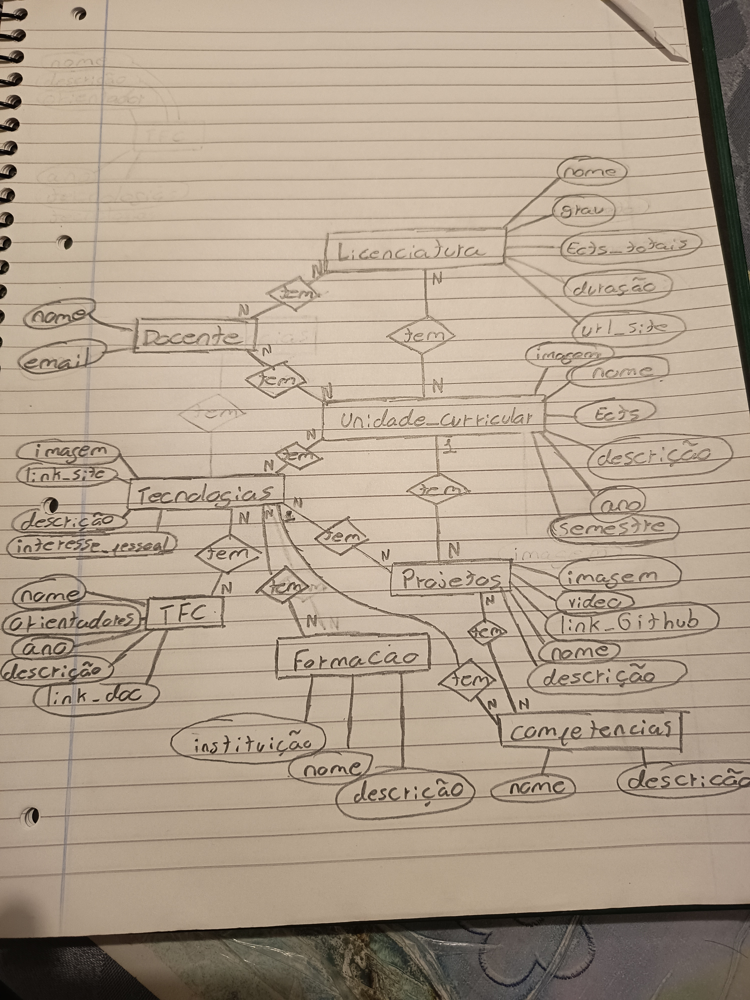

# Modelação

1. ligação Licenciatura-Docente é N para N, pois um curso por exemplo Licenciatura Engenharia Informatica tem varios docentes/professores ao mesmo tempo que esse docente pode estar em varios cursos
2. ligação Licenciatura-Unidade_Curricular tembem é N para N pelo mesmo motivo que Licenciatura-Docente exemplo, tanto Engenharia Informatica e Engenharia Informatica de Redes e Telecumincações tem uma unidade curricular chamada Redes e Telecuminações
3. ligação Unidade_Curricular-Docente é N para N, pelo mesmo motivo da ligação Licenciatura-Docente o mesmo Docente pode dar varias cadeiras no mesmo semestre
4. ligação Unidade_Curricular-Tecnologias é N para N, Java esta presente em Algoritmia de Dados e LP2 ou Desenvolvimento de Interface Web usa HTML, CSS, JavaScript, Next, Vercel,...
5. ligação Unidade_Curricular-Projeto aqui já faz sentido sser ligação de 1 para N pois o projeto foi desenvolvido apenas para aquela cadeira exemplo o Portfolia é desenvolvida para Programação Web, mas Programação web terá varios projetos
6. ligação Tecnologia-TFC é N para N, pois um TFC como podemos ver no JSON tem varias tecnologias, essas que tambem são usadas em varios TFCs
7. ligação Tecnologia-Formação é N para N, pois uma formação pode abordar varias tecnologias no qual essa mesmas tecnologias pode estar em varias formações
8. ligação Tecnologia-Projetos é N para N, sendo a mesma logica do Tecnologia-TFC
9. ligação Competecias-Projetos é N para N, pois o desemvolvimento de um projeto pode dar varias competencias tanto tecnicas como socias, competencias essa que podem ser reforçadas com o desenvolvimento de mais projetos
10. ligação Competencias-Tecnologia é 1 para N, pois não é possivel a pessoa ter a mesma competencia neste caso técnica duas vezes, nesse caso seria só repetição de informação na nossa base de dados

# Dificuldades e Erros
1. Dificuldades numa pequena questão de lógica mas com ajuda de AI lá consegui resolver

# Usei AI no que?
1. Usei para ajudar a finalizar a modelação, pois é muito chato estar a escrever "nome = models.CharField(max_length=100)" fazendo a mão as tres primeiras classes depois pedi para fazer o resto usando o que já tinha como modelo, para evitar alucinação.
2. Usei para ajudar a resolver um problema na minha logica no loader.